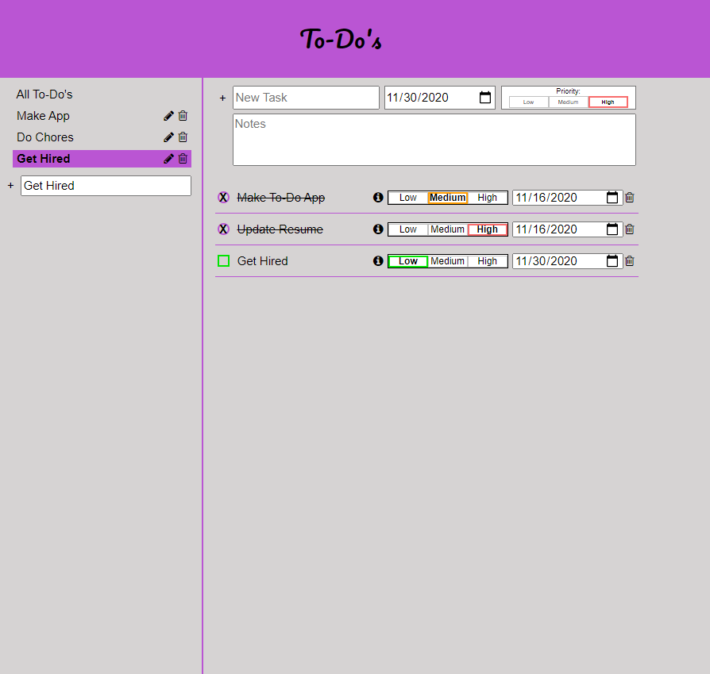

## To-Do List
App to help organize your To-Do's.

🔗 **Live preview** of the app is [here](https://j-haze.github.io/to-do-list).

### Purpose: ###
Create an interactive To-Do list. The app shows off my ability to create a functional application using JavaScript.

### Features: ###

* Play against the computer
* Play against another human (local)

### Built With: ###

* HTML/CSS
* JavaScript
* Webpack
* Local Storage

### Picture: ###

